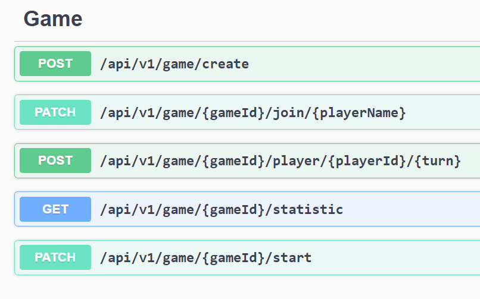

# RockPaperScissors

## Действия, необходимые для запуска проекта

```bash
git clone git@github.com:MechanicalNick/RockPaperScissors.git
cd RockPaperScissors
docker-compose up -d
```

В докере развернётся постгрес и образ с сервисом

### Endpoints

### Swagger
http://localhost:5080/index.html
### Описание и правила игры:
Игра проводится между двумя игроками в 5 раундов. Игра может завершиться досрочно.
В каждом раунде игроки могут выполнить только по одному ходу (выбросив камень, ножницы или бумагу),
после чего автоматически начинается новый раунд. По завершению всех раундов можно получить общий
результат игры и завершить игру или начать заново.
#### Комментарии
- http://localhost:5080/api/v1/game/create?playerName=nikita - создаёт игру и пользователя nikita (если он не создан ранее). Имена уникальны. Имя не должно быть "pc" (имя бота).
- http://localhost:5080/api/v1/game/1/join/vasya - добавляет в существующую игру 1 пользователя vasya
- http://localhost:5080/api/v1/game/2/start - добавляет в игру бота, если второй игрок не был добавлен
- http://localhost:5080/api/v1/game/1/player/2/rock - создаёт ход в игре 1 для игрока 2 с выбором камня
- http://localhost:5080/api/v1/game/1/statistic - показывает статистику игры на любом её этапе. Если игры нет, то покажет пустую статистику
